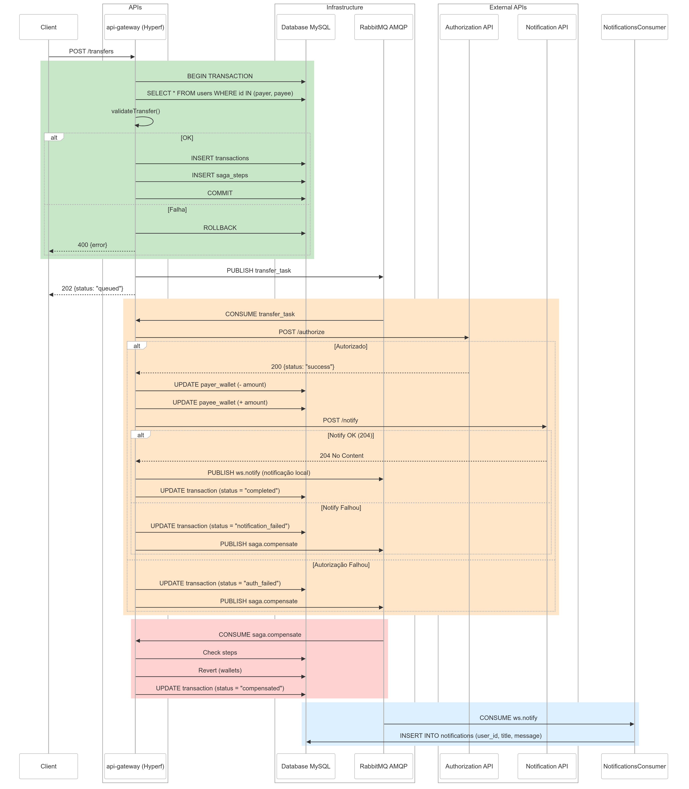

# Digital Wallet API

## Tecnologias Utilizadas

Este projeto segue uma arquitetura de microsserviços, promovendo escalabilidade e resiliência através de comunicação
assíncrona. As principais tecnologias incluem:

- **Hyperf (PHP):** API Gateway principal, centralizando o fluxo de requisições e testes.
- **MySQL:** Banco relacional para garantir integridade de dados.
- **Redis:** Cache e controle de sessões.
- **RabbitMQ:** Sistema de mensageria para orquestração de eventos e aplicação do padrão Saga.

## Arquitetura

- Baseada em **Event-Driven Architecture (EDA)** com consistência eventual.
- Uso do padrão **Saga** para controle de transações distribuídas.
- Circuit Breaker previsto para isolamento de falhas em serviços externos.
- Separado por escopos de microsserviços: transferências, notificações, compensações e autenticação (futuramente).

## Collection Postman

A collection Postman contém os principais endpoints organizados por domínio e escopo da aplicação.

[Acessar a collection](https://www.postman.com/winter-space-365675/workspace/digital-wallet-api/collection/27150340-decf2260-6581-47a6-b3f0-0cf9928cfd4c?action=share&creator=27150340)

## Documentações

- [Documentação da Arquitetura](docs/ARCHITECTURE.md)
- [Guia de Desenvolvimento](docs/DEVELOPER.md)

## UML da Arquitetura



## Pré-requisitos

- Docker e Docker Compose

## Instalação

### 1. Clonar o repositório

```bash
    git clone https://github.com/SamuelLeutner/digital-wallet-api.git
    cd digital-wallet-api
```

### 2. Copiar variáveis de ambiente

```bash
  cp .env-example .env
```

### 3. Construir o projeto

```bash
  docker compose build
```

### 4. Subir containers

```bash
  docker compose up -d
```

### 5. Rodar migrações e seeders

```bash
  docker compose exec api_gateway php bin/hyperf.php migrate --seed
```

### 6. Verificar qualidade do código

```bash
    docker compose run --rm phpqa phpmd app text phpmd.xml | grep -v 'Deprecated'
```

### 7. Executar testes

```bash
  docker compose exec api_gateway composer test
```
